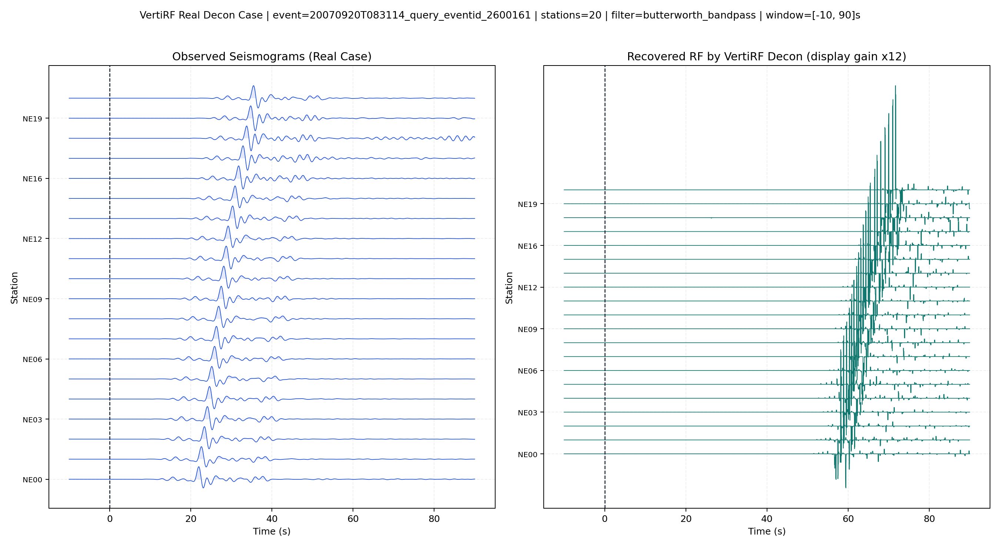
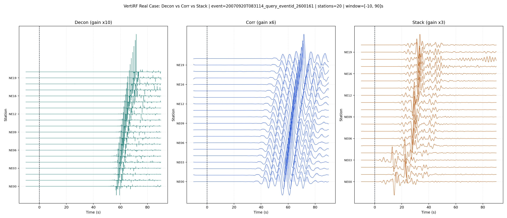
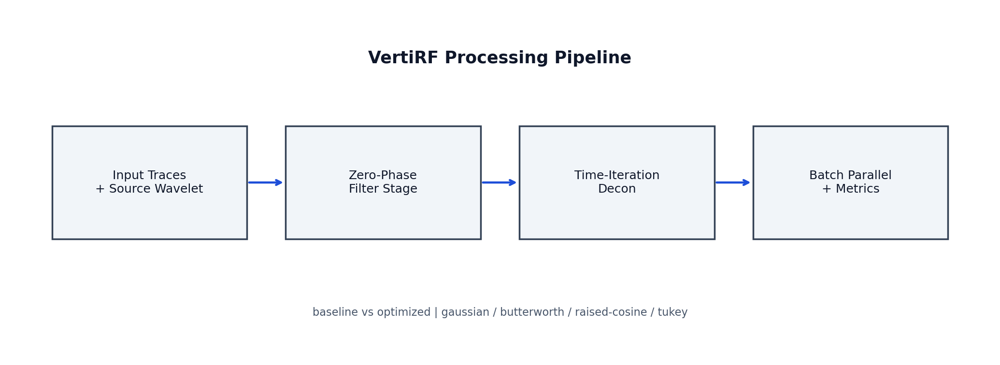

# VertiRF

English

VertiRF is a standalone open-source toolkit for vertical receiver-function workflows. It supports three VRF methods (`decon`, `corr`, `stack`) with both serial and parallel execution paths.

Chinese

VertiRF 是一个独立开源工具包，面向垂向接收函数（VRF）流程。当前支持三种方法（`decon`、`corr`、`stack`），并提供串行与并行两种执行路径。

## Features | 功能特性

- Three methods in one interface:
  - `decon`: time-iteration deconvolution
  - `corr`: cross-correlation retrieval with configurable smoothing and post-filter
  - `stack`: peak-window aligned stacking with configurable peak window
- Zero-phase filter options:
  - `gaussian`
  - `butterworth_bandpass`
  - `raised_cosine_bandpass`
  - `tukey_bandpass`
- Parallel batch execution (`--jobs`) for all methods.
- AI-agent-callable JSON-RPC interface (`vertirf.agent.server`).
- Engineering dataset/repro benchmark utilities.

## Project Layout | 目录结构

```text
VertiRF/
  src/vertirf/
    station/
    catalog/
    waveform/
    filters/
    core/
      decon.py
      methods.py
    agent/
    cli.py
  tests/
  scripts/
  examples/
  assets/
  .github/workflows/
  architecture.md
  tasks.md
  AGENTS.md
```

## Quick Start | 快速开始

```bash
cd D:\works_2\VertiRF
python -m pip install -e .[dev]
```

### Run Decon / Corr / Stack

```bash
# decon
python -m vertirf.cli run-synthetic --method decon --mode optimized --jobs 4

# corr (smoothing + post-filter selectable)
python -m vertirf.cli run-synthetic \
  --method corr --mode optimized --jobs 4 \
  --corr-smoothing-bandwidth-hz 0.25 \
  --corr-post-filter-type gaussian

# stack (peak window selectable)
python -m vertirf.cli run-synthetic \
  --method stack --mode optimized --jobs 4 \
  --stack-peak-window-start-sec -2 \
  --stack-peak-window-end-sec 20
```

### Method Parallel Benchmark

```bash
python scripts/method_parallel_benchmark.py \
  --out method_parallel_benchmark_summary.json \
  --traces 96 --samples 1024 --repeat 2 --jobs 4
```

### Native Backend Status (C/C++)

```bash
python scripts/check_native_backend.py --out assets/native_backend_status.json
```

## Real Case Figures | 真实案例图

### Real Decon Case | 单方法 decon 案例



### Three Methods on One Real Case | 同一真实案例的三方法对比

English

The following figure shows `decon/corr/stack` results for the same real event case.

Chinese

下图展示同一真实事件案例下 `decon/corr/stack` 三种方法的结果对比。



Regenerate command:

```bash
python scripts/generate_real_case_three_methods_wiggle.py \
  --input-dir D:\works_2\seismic_data_retrieval_1\data\prompt19\p14_like_lowpass_t200\convolved_npz \
  --stations 20 --component z \
  --filter-type butterworth_bandpass --low-hz 0.1 --high-hz 0.8 \
  --corr-smoothing-bandwidth-hz 0.25 --corr-post-filter-type gaussian \
  --stack-peak-window-start-sec -2 --stack-peak-window-end-sec 20 \
  --allow-negative-impulse --time-end-sec 90 \
  --out assets/real_case_three_methods_wiggle.png
```

## MCP Client Example | MCP 客户端示例

```bash
python examples/mcp_client_example.py
```

## Engineering Benchmark Dataset | 工程基准数据集

Build dataset from existing event NPZ files:

```bash
python scripts/build_engineering_dataset.py \
  --input-dir D:\works_2\seismic_data_retrieval_1\data\prompt19\p14_like_lowpass_t200\convolved_npz \
  --out data/engineering_benchmark/engineering_dataset.npz \
  --events 12 --stations 20 --component z --seed 20260303
```

Run reproducible engineering benchmark:

```bash
python scripts/run_engineering_repro.py \
  --dataset data/engineering_benchmark/engineering_dataset.npz \
  --out data/engineering_benchmark/repro_report.json \
  --jobs 4 --repeat 1 --filter-type butterworth_bandpass --allow-negative-impulse
```

## CI | 持续集成

GitHub Actions workflow: `.github/workflows/ci.yml`

Pipeline includes:
- `ruff` style check
- `pytest`
- decon benchmark smoke
- method parallel benchmark smoke

## Pipeline Overview | 流程示意



## Documentation | 文档

- [architecture.md](architecture.md): requirements and technical architecture.
- [tasks.md](tasks.md): staged development tasks and acceptance criteria.
- [AGENTS.md](AGENTS.md): AI agent execution rules for this project.
